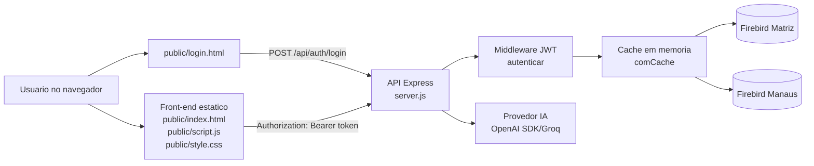
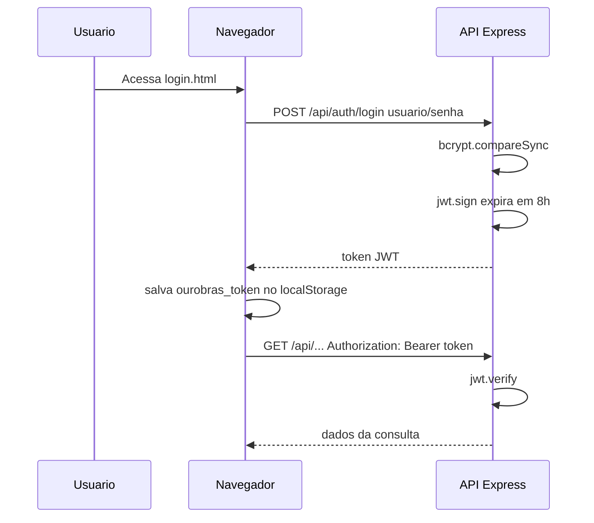
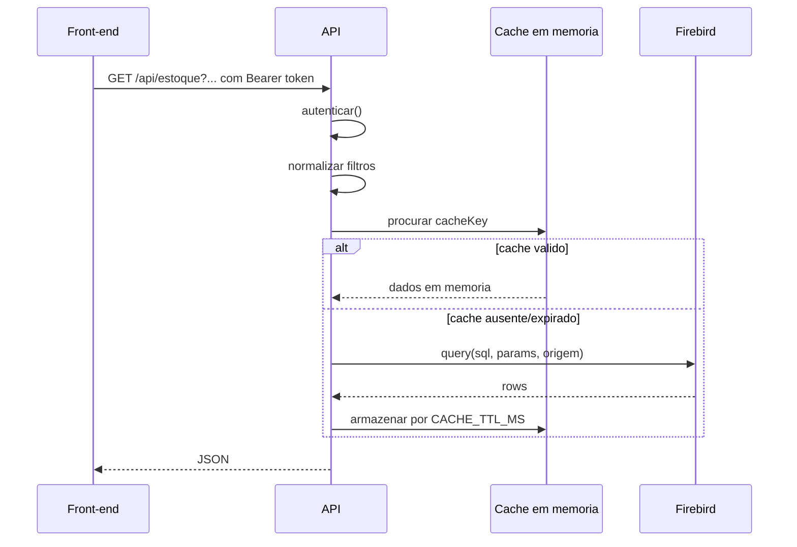
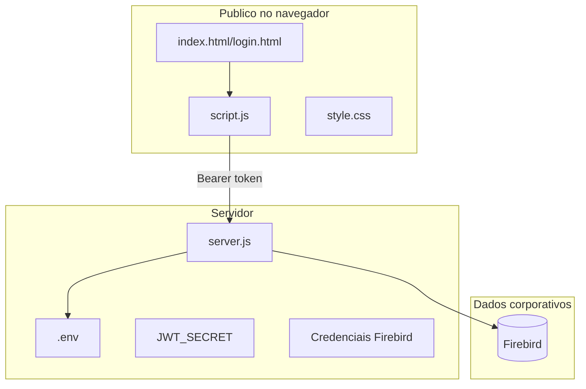

# Arquitetura do Projeto

Este documento cataloga a arquitetura atual do projeto `ourobras-classificacao` e serve como mapa para evolucoes futuras.

## Visao Geral

O sistema e uma aplicacao Node.js/Express que entrega um front-end estatico e uma API protegida por JWT. A API consulta bancos Firebird, agrega dados de estoque, vendas, auditoria, contratos e marketing, e tambem envia contextos resumidos para uma integracao de IA.

## Fluxo de Autenticacao

## Fluxo de Consulta

## Componentes Principais

| Area | Arquivo | Responsabilidade |
| --- | --- | --- |
| Servidor HTTP | `server.js` | Configura Express, middlewares, rotas e startup |
| Seguranca HTTP | `server.js` | Helmet, CORS, rate limit e autenticacao JWT |
| Banco de dados | `server.js` | Conexao Firebird Matriz/Manaus e funcao `query` |
| Cache | `server.js` | Cache simples em memoria com TTL |
| Estoque | `server.js`, `public/script.js` | Dashboards, ranking, produtos e filtros |
| Vendas | `server.js`, `public/script.js` | Consulta por periodo, loja, fabricante e coordenador |
| Auditoria | `server.js`, `public/script.js` | Estoque com grade, valores opcionais e exportacoes |
| Consultas ERP | `server.js`, `public/script.js` | Movimentacoes por tipo/status/loja/data |
| Contratos | `server.js`, `public/script.js` | Parametros, clientes, produtos, compradores e validacao |
| Marketing | `server.js`, `public/script.js` | Clientes novos, grupos e exportacoes |
| IA | `server.js`, `public/script.js` | Chat e resumos baseados em dados agregados |

## Fronteiras de Seguranca

Tudo em `public/` e visivel no F12. Segredos e regras sensiveis devem ficar apenas no servidor.

## Estado Atual Observado

- API exige JWT para `/api/`, exceto `/api/ping` e `/api/auth/login`.
- `public/` e servido estaticamente antes do middleware de autenticacao.
- `.env` esta ignorado no Git e nao apareceu como arquivo versionado.
- Login usa hash bcrypt no `.env`.
- CORS possui whitelist, mas atualmente libera origens bloqueadas por causa do retorno temporario.
- Algumas consultas usam parametros `?`; outras ainda montam trechos SQL por concatenacao.
- O front usa `localStorage` para token e `innerHTML` em varias renderizacoes.

