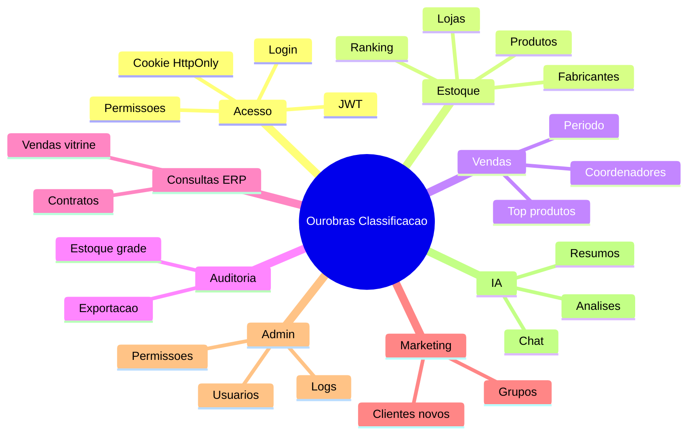

# Catalogo do Projeto

## Identidade

| Item | Valor |
| --- | --- |
| Nome | `ourobras-classificacao` |
| Versao | `2.0.0` |
| Runtime | Node.js |
| Framework API | Express |
| Banco ERP | Firebird somente leitura |
| Banco App | MySQL/MariaDB para usuarios, permissoes e logs |
| Front-end | HTML, CSS e JavaScript estatico |
| Autenticacao | JWT em cookie HttpOnly |
| IA | OpenAI SDK configurado para endpoint compativel |

## Estrutura Atual

```text
ourobras-classificacao/
  server.js
  package.json
  package-lock.json
  README.md
  .gitignore
  .env
  db/
    migrations/
  docs/
    archive/
  public/
    img/
    index.html
    login.html
    login.js
    script.js
    style.css
  src/
    app.js
    config/
    db/
    middlewares/
    routes/
    services/
  tests/
  tools/
```

## Arquivos Principais

| Arquivo | Papel |
| --- | --- |
| `server.js` | Entrada da API |
| `src/app.js` | Configuracao Express, middlewares e rotas |
| `src/config/env.js` | Variaveis de ambiente |
| `src/config/modules.js` | Catalogo central de abas/permissoes |
| `src/db/firebird.js` | Conexao Firebird ERP somente leitura |
| `src/db/app-mysql.js` | Conexao MySQL da aplicacao |
| `src/middlewares/auth.js` | JWT, cookie, sessao e permissoes |
| `src/middlewares/security.js` | Helmet, CSP, CORS e rate limit |
| `src/routes/*.routes.js` | Rotas por dominio/aba |
| `src/services/users.js` | Usuarios e permissoes no MySQL App |
| `src/services/audit-log.js` | Logs de auditoria |
| `public/index.html` | Painel autenticado |
| `public/login.html` | Tela de login |
| `public/login.js` | Logica externa do login |
| `public/script.js` | Interacoes do painel |
| `tests/auth.test.js` | Testes de autenticacao e permissoes |
| `tools/seed-admin-mysql.js` | Sincroniza admin inicial no MySQL App |

## Modulos Funcionais



## Estado de Seguranca

| Item | Estado |
| --- | --- |
| Banco ERP somente leitura | Implementado por regra arquitetural |
| Banco App separado | Implementado com MySQL/MariaDB |
| JWT em localStorage | Removido |
| Cookie HttpOnly | Implementado |
| Permissao por aba | Implementado |
| Abas ocultas sem permissao | Implementado |
| CSP sem script inline | Implementado |
| Logs de auditoria | Implementado |
| Testes automatizados | Implementado para auth/permissoes |
| `style-src unsafe-inline` | Ainda pendente |

## Observacao

`docs/archive/server.legacy.js` guarda o servidor antigo apenas como referencia historica. A execucao atual usa `server.js` e `src/app.js`.
